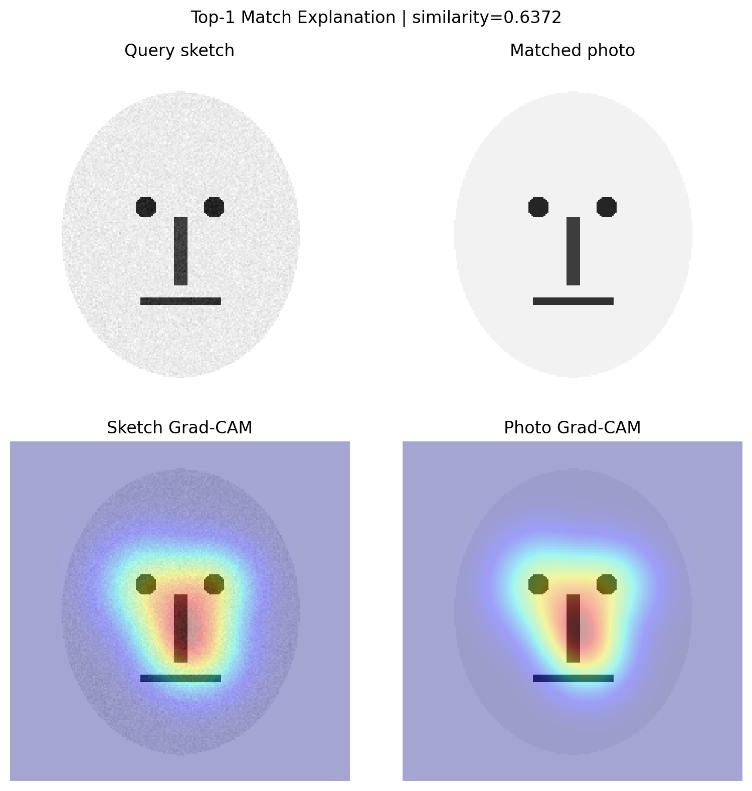
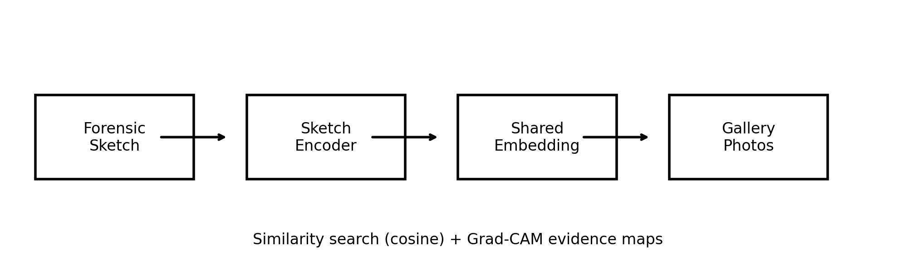

# Explainable Forensic Sketch Matching

This project is a research-ready baseline for matching forensic sketches to real face photos and explaining why a match was retrieved. It is designed around the CUFS and CUFSF datasets and packages the workflow needed for an XAI-focused academic project:

- cross-domain sketch-to-photo retrieval
- reproducible train, evaluation, and inference scripts
- Grad-CAM visual explanations for matched facial regions

## Problem Statement

Develop a deep learning system that matches forensic sketches to real face images and explains the facial features responsible for the match using Explainable AI.

## Why This Is Useful

The system targets the real criminal-investigation workflow:

- a witness describes a suspect
- a police artist creates a sketch
- the system searches a mugshot or criminal-face database
- investigators review both the retrieved identity and the facial regions that drove the match

This makes the project practical for law enforcement, forensic labs, and explainable biometrics research.

## Project Contribution

This repository implements a compact improvement-oriented baseline:

- a dual-branch Siamese retrieval model with a shared embedding space
- contrastive cross-domain training between sketch and photo pairs
- Grad-CAM explanations on both the sketch and matched photo
- dataset-agnostic pair discovery with an optional CSV manifest

## Project Layout

```text
.
|-- README.md
|-- pyproject.toml
|-- requirements.txt
|-- src/
|   `-- sketch_xai/
|       |-- __init__.py
|       |-- data.py
|       |-- evaluate.py
|       |-- gradcam.py
|       |-- infer.py
|       |-- losses.py
|       |-- metrics.py
|       |-- model.py
|       `-- train.py
`-- templates/
    `-- pairs_manifest.csv
```

## Dataset Setup

1. Download CUFS or CUFSF from the official CUHK dataset pages:
   - [CUFS](https://mmlab.ie.cuhk.edu.hk/archive/facesketch.html)
   - [CUFSF](https://mmlab.ie.cuhk.edu.hk/archive/cufsf/)
2. Extract the dataset under `data/`.
3. If automatic pair discovery cannot infer sketch and photo files from the folder names, create a CSV based on `templates/pairs_manifest.csv` and place it inside the dataset root as `pairs_manifest.csv`.

Expected examples:

```text
data/
  CUFS/
    photos/
    sketches/

data/
  CUFSF/
    pairs_manifest.csv
    photos/
    sketches/
```

## Installation

```powershell
python -m venv .venv
.\.venv\Scripts\Activate.ps1
python -m pip install --upgrade pip
python -m pip install -r requirements.txt
python -m pip install -e .
```

## Training

```powershell
python -m sketch_xai.train `
  --data-root data/CUFS `
  --output-dir outputs/cufs-baseline `
  --epochs 25 `
  --batch-size 16 `
  --embedding-dim 256
```

Use `--pretrained` if you want ImageNet initialization for the ResNet backbone.

## Evaluation

```powershell
python -m sketch_xai.evaluate `
  --data-root data/CUFS `
  --checkpoint outputs/cufs-baseline/best.pt `
  --split test `
  --output-dir outputs/cufs-eval
```

This writes retrieval metrics such as `rank@1`, `rank@5`, `rank@10`, and `mrr` to a JSON file.

## Inference And XAI

```powershell
python -m sketch_xai.infer `
  --data-root data/CUFS `
  --checkpoint outputs/cufs-baseline/best.pt `
  --query-id ar-001 `
  --topk 5 `
  --output-dir outputs/cufs-demo
```

Outputs (generated locally under `outputs/` and not committed to git):

- `rankings.csv` with top matches
- `explanation_top1.png` showing the query sketch, top photo, and Grad-CAM overlays
- `summary.json` with the match score and selected identity

## Example Outputs (Included In Repo)

The repository includes example artifacts under `docs/` so you can see what the system produces without downloading the dataset:

- `docs/example_explanation.png` (example Grad-CAM-style visualization)
- `docs/example_rankings.csv` (example top-k ranking format)
- `docs/example_summary.json` (example JSON summary format)



## System Overview



## References Used In The Project Brief

- X. Wang and X. Tang, "Face Photo-Sketch Synthesis and Recognition," IEEE TPAMI, 2009.
- S. M. Iranmanesh et al., "Deep Sketch-Photo Face Recognition Assisted by Facial Attributes," arXiv:1808.00059, 2018.
- L. Zhang et al., "End-to-End Photo-Sketch Generation via Fully Convolutional Representation Learning," ICMR, 2015.
- Official CUFS/CUFSF dataset pages from CUHK.
